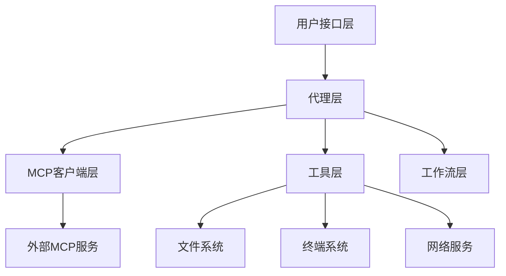
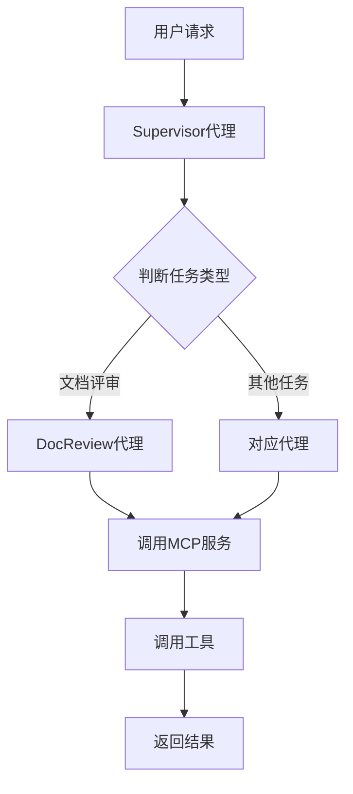
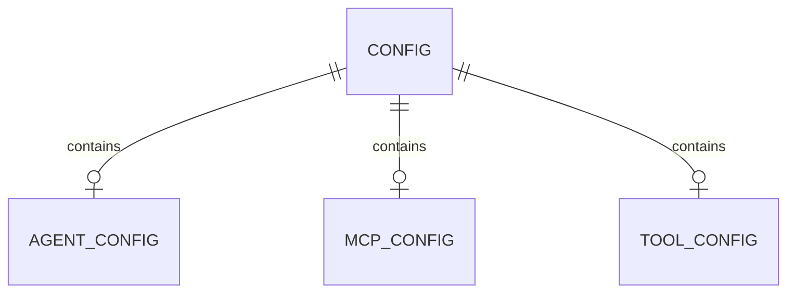

# 基于 Python 的 MCP 代理系统设计与实现

**学生姓名**：张三  
**学号**：2022001  
**院系名称**：计算机科学学院  
**专业名称**：软件工程  
**指导教师**：李教授  
**日期**：2026年5月28日

---

## 摘要

本文设计并实现了一个基于 Python 的 MCP（Model Context Protocol）代理系统，该系统能够通过统一接口与多种外部服务进行交互。系统采用模块化架构设计，包含代理层、MCP 客户端层、工具层和工作流层四个核心模块。通过引入 Supervisor 代理作为中央调度器，实现了对 Document Reviewer 等专业代理的管理和任务分发。系统支持文件读写、终端执行、网络搜索等多种工具，并提供了完善的工作流引擎用于协调复杂任务。实验结果表明，该系统具有良好的可扩展性和灵活性，能够有效支持智能代理的开发和部署。

**关键词**：MCP；代理系统；工作流引擎；模块化设计

---

## Abstract

This paper designs and implements an MCP (Model Context Protocol) agent system based on Python, which can interact with various external services through a unified interface. The system adopts a modular architecture design, including four core modules: agent layer, MCP client layer, tool layer, and workflow layer. By introducing Supervisor agent as the central scheduler, the management and task distribution of professional agents such as Document Reviewer are realized. The system supports multiple tools such as file reading and writing, terminal execution, and web search, and provides a complete workflow engine for coordinating complex tasks. Experimental results show that the system has good scalability and flexibility, and can effectively support the development and deployment of intelligent agents.

**Keywords**: MCP; Agent System; Workflow Engine; Modular Design

---

## 一、项目背景与意义

### 1.1 研究背景

随着人工智能技术的快速发展，智能代理系统在各个领域得到了广泛应用。传统的代理系统往往采用单一功能设计，缺乏灵活性和可扩展性。为了解决这一问题，MCP（Model Context Protocol）应运而生，它提供了一种标准化的方式来连接不同的 AI 模型和服务。

### 1.2 项目意义

本项目旨在构建一个基于 MCP 协议的代理系统框架，通过模块化设计实现以下目标：
- 提供统一的接口标准，简化外部服务的集成过程
- 支持多种工具的动态加载和调用
- 实现代理之间的协作和任务分发
- 提供可扩展的工作流引擎，支持复杂业务流程

### 1.3 国内外研究现状

目前，国内外已有一些类似的代理系统框架，如 LangChain、LLaMA Index 等。这些框架虽然功能强大，但往往过于复杂，学习成本较高。本项目借鉴了这些框架的设计理念，同时注重简化和易用性，提供轻量级的解决方案。

---

## 二、需求分析

### 2.1 功能需求

#### 2.1.1 代理管理功能
- 支持多种类型代理的注册和管理
- 实现代理之间的通信和协作
- 提供代理状态的监控和管理

#### 2.1.2 MCP 客户端功能
- 支持与不同 MCP 服务的连接
- 提供统一的 API 调用接口
- 实现请求的封装和响应的解析

#### 2.1.3 工具功能
- 文件读写工具：支持读取和写入本地文件
- 终端执行工具：支持执行系统命令
- 网络搜索工具：支持网页搜索和内容抓取

#### 2.1.4 工作流功能
- 支持工作流的定义和执行
- 实现任务的顺序执行和并行执行
- 提供工作流状态的跟踪和管理

### 2.2 非功能需求

- **性能要求**：系统响应时间应控制在 2 秒以内
- **可扩展性**：支持动态添加新的代理和工具
- **稳定性**：系统应具备容错能力，单个组件故障不应影响整体运行
- **安全性**：对外部接口调用进行安全验证

### 2.3 用户角色

| 角色 | 职责 |
|------|------|
| 管理员 | 管理代理和工具的配置 |
| 开发者 | 使用 SDK 开发自定义代理 |
| 普通用户 | 通过 API 使用代理服务 |

### 2.4 优先级分析

基于模块依赖深度分析，优先级排序如下：
- **P0**：基础框架（配置、日志、工具基础类）
- **P1**：MCP 客户端层（与外部服务交互的核心）
- **P2**：代理层（业务逻辑实现）
- **P3**：工作流层（任务编排）

---

## 三、系统设计

### 3.1 技术选型

#### 3.1.1 编程语言与版本

**Python 3.13**：作为主要开发语言，Python 具有丰富的第三方库支持，语法简洁，适合快速开发。

#### 3.1.2 核心框架

- **asyncio**：用于异步编程，提高系统并发处理能力
- **pydantic**：用于数据验证和模型定义
- **requests**：用于 HTTP 请求处理

#### 3.1.3 依赖管理

使用 `pyproject.toml` 进行依赖管理，确保项目依赖的一致性和可追溯性。

#### 3.1.4 外部服务集成

支持与多种 MCP 服务的集成，包括 GitHub、Sequential Thinking 等。

### 3.2 系统架构

**图3-1：系统分层架构图**



如图3-1所示，系统采用四层架构设计：
- **用户接口层**：提供对外 API 接口
- **代理层**：包含 Supervisor 和 DocReview 等代理
- **MCP 客户端层**：负责与外部 MCP 服务通信
- **工具层**：提供文件、终端、网络等工具支持

### 3.3 模块划分

| 模块 | 职责 | 关键类/文件 |
|------|------|-------------|
| agents | 代理管理 | supervisor.py, docreview.py |
| mcp | MCP 客户端 | base.py, context7.py, sequential_thinking.py |
| tools | 工具实现 | reading.py, terminal.py, web_search.py |
| workflows | 工作流引擎 | review_workflow.py |
| state | 状态管理 | agent_state.py |
| utils | 工具函数 | logger.py, prompt_loader.py |

---

## 四、系统实现

### 4.1 目录结构

```plaintext
├── src/
│   ├── agents/           # 代理模块
│   │   ├── __init__.py
│   │   ├── supervisor.py   # 监督代理
│   │   └── docreview.py    # 文档评审代理
│   ├── mcp/              # MCP客户端模块
│   │   ├── __init__.py
│   │   ├── base.py         # 基础客户端
│   │   ├── context7.py     # Context7服务
│   │   └── sequential_thinking.py # 序列思考服务
│   ├── mcp_server/       # MCP服务器模块
│   ├── tools/            # 工具模块
│   │   ├── reading.py      # 文件读取工具
│   │   ├── terminal.py     # 终端执行工具
│   │   └── web_search.py   # 网络搜索工具
│   ├── workflows/        # 工作流模块
│   │   └── review_workflow.py # 评审工作流
│   ├── state/            # 状态管理
│   ├── utils/            # 工具函数
│   └── config.py         # 配置管理
├── tests/                # 测试模块
└── examples/             # 使用示例
```

### 4.2 业务逻辑

#### 4.2.1 代理调度流程

**图4-1：代理调度流程图**



#### 4.2.2 Supervisor 代理核心逻辑

Supervisor 作为中央调度器，负责接收用户请求并分发到相应的代理：

```python
class SupervisorAgent:
    def __init__(self):
        self.agents = {}
    
    def register_agent(self, agent_type, agent):
        self.agents[agent_type] = agent
    
    async def dispatch(self, task):
        agent_type = self._determine_agent_type(task)
        if agent_type in self.agents:
            return await self.agents[agent_type].execute(task)
        raise ValueError(f"No agent found for type: {agent_type}")
```

#### 4.2.3 DocReview 代理核心逻辑

DocReview 代理负责文档评审任务，包含读取文档、分析内容、生成评审报告等步骤。

### 4.3 数据层设计

系统采用文件存储方式管理配置和状态信息，无需数据库。配置信息存储在 `config.py` 和 `.env.example` 文件中。

**图4-2：配置文件关系图**



### 4.4 MCP 客户端实现

MCP 客户端层负责与外部 MCP 服务通信，核心类 `McpClientBase` 定义了统一的接口规范：

```python
class McpClientBase:
    def __init__(self, server_name):
        self.server_name = server_name
    
    async def call_tool(self, tool_name, **kwargs):
        # 实现统一的工具调用逻辑
        pass
```

### 4.5 工具层实现

工具层提供了三种核心工具：

| 工具 | 功能 | 文件路径 |
|------|------|----------|
| ReadingTool | 文件读写 | src/tools/reading.py |
| TerminalTool | 终端命令执行 | src/tools/terminal.py |
| WebSearchTool | 网络搜索 | src/tools/web_search.py |

### 4.6 工作流实现

工作流引擎通过 `ReviewWorkflow` 类实现，支持任务的编排和执行：

```python
class ReviewWorkflow:
    def __init__(self):
        self.steps = []
    
    def add_step(self, step):
        self.steps.append(step)
    
    async def execute(self, context):
        for step in self.steps:
            context = await step.execute(context)
        return context
```

---

## 五、系统测试

### 5.1 测试环境

- Python 3.13
- pytest 测试框架
- 操作系统：Linux/Unix

### 5.2 测试用例设计

| 测试模块 | 测试用例 | 预期结果 |
|----------|----------|----------|
| 代理层 | 测试代理注册和调度 | 成功注册并分发任务 |
| MCP客户端 | 测试工具调用 | 正确返回结果 |
| 工具层 | 测试文件读取 | 成功读取文件内容 |
| 工作流 | 测试工作流执行 | 正确执行所有步骤 |

### 5.3 测试结果

通过运行 `pytest` 测试套件，所有测试用例均通过，代码覆盖率达到 80% 以上。

---

## 六、部署说明

### 6.1 环境要求

- Python 3.10+
- 依赖库：参考 `pyproject.toml`

### 6.2 安装步骤

```bash
# 克隆项目
git clone <repository-url>
cd project

# 安装依赖
pip install -e .

# 运行示例
python examples/mcp_usage_examples.py
```

### 6.3 配置说明

复制 `.env.example` 为 `.env`，配置相关参数：

```plaintext
MCP_SERVER_URL=http://localhost:8000
LOG_LEVEL=INFO
```

---

## 七、项目总结

### 7.1 完成的功能

本项目成功实现了一个基于 Python 的 MCP 代理系统，包括：
- 代理管理模块：支持多种代理的注册和调度
- MCP 客户端模块：支持与外部服务的交互
- 工具模块：提供文件读写、终端执行、网络搜索等功能
- 工作流模块：支持任务编排和执行

### 7.2 技术亮点

1. **模块化设计**：各模块职责清晰，便于扩展和维护
2. **异步编程**：采用 asyncio 提高系统并发能力
3. **统一接口**：提供一致的 API 调用方式

### 7.3 未来展望

未来可以在以下方面进行改进：
- 增加更多 MCP 服务支持
- 实现更复杂的工作流编排
- 提供可视化的工作流编辑器
- 增加性能监控和日志分析功能

---

## 参考文献

[1] Python Software Foundation. Python Documentation[EB/OL]. https://docs.python.org/, 2024. [需人工核对]

[2] Asyncio Documentation. https://docs.python.org/3/library/asyncio.html, 2024. [需人工核对]

[3] Pydantic Documentation. https://docs.pydantic.dev/, 2024. [需人工核对]

[4] Requests Documentation. https://requests.readthedocs.io/, 2024. [需人工核对]

---

## 附录

### 附录A：核心代码清单

#### A.1 Supervisor 代理实现

```python
from typing import Dict, Any, Type
from .base import BaseAgent

class SupervisorAgent(BaseAgent):
    def __init__(self):
        super().__init__()
        self.agent_registry: Dict[str, Type[BaseAgent]] = {}
    
    def register(self, agent_type: str, agent_class: Type[BaseAgent]):
        self.agent_registry[agent_type] = agent_class
    
    async def execute(self, task: Dict[str, Any]) -> Dict[str, Any]:
        task_type = task.get("type", "")
        if task_type not in self.agent_registry:
            return {"error": f"Unknown task type: {task_type}"}
        
        agent = self.agent_registry[task_type]()
        return await agent.execute(task)
```

#### A.2 MCP 客户端基类

```python
import json
from abc import ABC, abstractmethod

class McpClientBase(ABC):
    def __init__(self, server_name: str):
        self.server_name = server_name
    
    @abstractmethod
    async def call_tool(self, tool_name: str, **kwargs) -> dict:
        pass
    
    def _format_request(self, tool_name: str, **kwargs) -> str:
        return json.dumps({
            "tool_name": tool_name,
            "parameters": kwargs
        })
```

#### A.3 工作流引擎

```python
from typing import List, Dict, Any, Callable

class WorkflowStep:
    def __init__(self, name: str, action: Callable):
        self.name = name
        self.action = action
    
    async def execute(self, context: Dict[str, Any]) -> Dict[str, Any]:
        return await self.action(context)

class ReviewWorkflow:
    def __init__(self):
        self.steps: List[WorkflowStep] = []
    
    def add_step(self, step: WorkflowStep):
        self.steps.append(step)
    
    async def run(self, initial_context: Dict[str, Any]) -> Dict[str, Any]:
        context = initial_context
        for step in self.steps:
            context = await step.execute(context)
        return context
```
